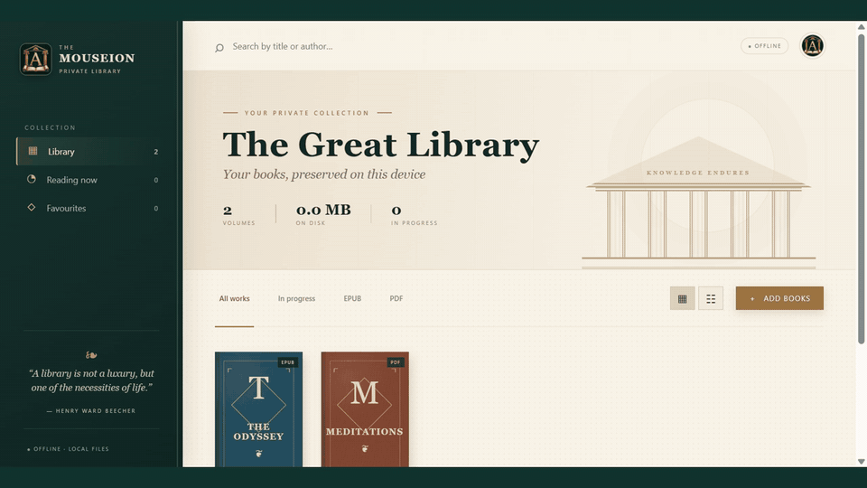
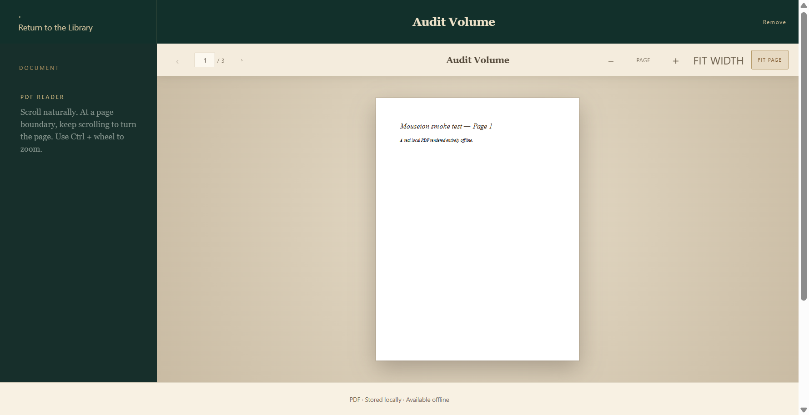
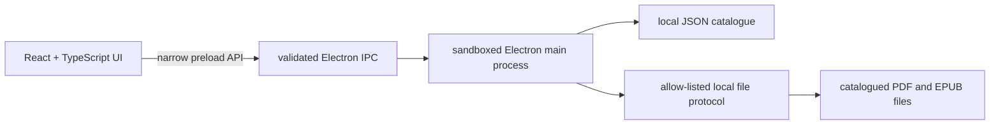

<div align="center">
  
  <h1>Mouseion</h1>
  <p><strong>Your private reading room for PDF and EPUB books.</strong></p>
  <p>A polished, offline-first Windows desktop library inspired by the ancient Mouseion of Alexandria.</p>

  [](https://github.com/Anantgoel2005/Mouseion/actions/workflows/ci.yml)
  [](https://github.com/Anantgoel2005/Mouseion/actions/workflows/codeql.yml)
  [](https://github.com/Anantgoel2005/Mouseion/releases/latest)
  [](LICENSE)
  [](#download)
</div>



<div align="center">
  <sub>Real application states captured by the Electron smoke test. <a href="https://github.com/Anantgoel2005/Mouseion/releases/download/v1.3.0/Mouseion-demo-v1.3.0.mp4">Watch the full-quality MP4</a>.</sub>
</div>

## Why Mouseion

Most reading apps begin with an account or a cloud upload. Mouseion begins with the files already on your computer. It provides a focused library and two purpose-built readers while keeping every book, preference, and reading position on the device.

| Capability | What it delivers |
| --- | --- |
| Private by design | No account, analytics, telemetry, cloud storage, or network dependency |
| PDF reading | Page navigation, animated turns, zoom, fit modes, keyboard, wheel, and swipe controls |
| EPUB reading | Metadata extraction, table of contents, and remembered reading position |
| Library management | Search, format filters, favourites, progress, grid/list views, and drag-and-drop import |
| Safe ownership | Removing an entry never deletes the original book file |
| Windows distribution | Installer and portable executables published through GitHub Releases |

<details>
<summary><strong>See the PDF reader</strong></summary>



</details>

## Download

Download the newest Windows installer or portable edition from the [latest GitHub release](https://github.com/Anantgoel2005/Mouseion/releases/latest).

- **Installer:** best for a normal Windows installation with Start menu and desktop shortcuts.
- **Portable:** runs directly without installation and is convenient for removable or temporary environments.

Mouseion currently targets 64-bit Windows 10 and newer. The release is not commercially code-signed, so Windows SmartScreen may show an “unrecognized app” warning. See [Security](#security-and-privacy) before running a downloaded binary.

For checksum verification, SmartScreen guidance, installer steps, portable usage, upgrades, and uninstallation, follow the [Windows installation guide](docs/INSTALLATION.md).

### Quick install

1. Download `Mouseion-Setup-1.3.0-x64.exe` and `SHA256SUMS.txt` from the [v1.3.0 release](https://github.com/Anantgoel2005/Mouseion/releases/tag/v1.3.0).
2. Verify the installer with `Get-FileHash .\Mouseion-Setup-1.3.0-x64.exe -Algorithm SHA256`.
3. Run the installer, choose the destination, and launch Mouseion from the Start menu or desktop shortcut.
4. Select **Add books** and choose local PDF or EPUB files. Mouseion catalogues them without copying or uploading them.

## Architecture

Mouseion deliberately keeps its privileged surface small:



The renderer runs with context isolation, sandboxing, Node integration disabled, and a restrictive Content Security Policy. The custom file protocol canonicalizes every request and serves only catalogued `.pdf` and `.epub` files; arbitrary local paths are rejected.

## Development

Requirements: Windows and Node.js 22 or newer.

```powershell
git clone https://github.com/Anantgoel2005/Mouseion.git
cd Mouseion
npm ci
npm run desktop:dev
```

In a second terminal:

```powershell
npm run desktop:start
```

## Quality gates

```powershell
npm run verify
npm run desktop:package
```

`npm run verify` performs a TypeScript check, production renderer build, catalogue and protocol tests, a real Electron smoke test, and a high-severity dependency audit. The smoke test creates temporary PDF and EPUB fixtures, opens both formats in the sandboxed desktop app, validates rendering and page traversal, and deletes the fixtures afterward.

Set `MOUSEION_DEMO_DIR` before running the smoke test to capture the reproducible README demo states:

```powershell
$env:MOUSEION_DEMO_DIR = "$PWD\demo-frames"
npm run smoke
```

Every pull request also runs the verification suite, creates an unpacked Windows package, and receives CodeQL analysis. Dependabot keeps npm packages and GitHub Actions under review.

## Security and privacy

- Library metadata is stored in the local application-data directory.
- Original books remain at their existing paths and are never uploaded by Mouseion.
- There are no accounts, analytics, cloud services, or telemetry.
- Official release assets expose SHA-256 digests in GitHub's release metadata.

Please report vulnerabilities privately using GitHub's **Security → Report a vulnerability** flow. Full guidance and the SmartScreen limitation are documented in [SECURITY.md](SECURITY.md).

## Build a release

```powershell
npm run desktop:build
```

The NSIS installer and portable executable are written to `release/`. Generated binaries are intentionally excluded from Git; official artifacts are distributed only through [GitHub Releases](https://github.com/Anantgoel2005/Mouseion/releases).

## License

Mouseion is available under the [MIT License](LICENSE).
